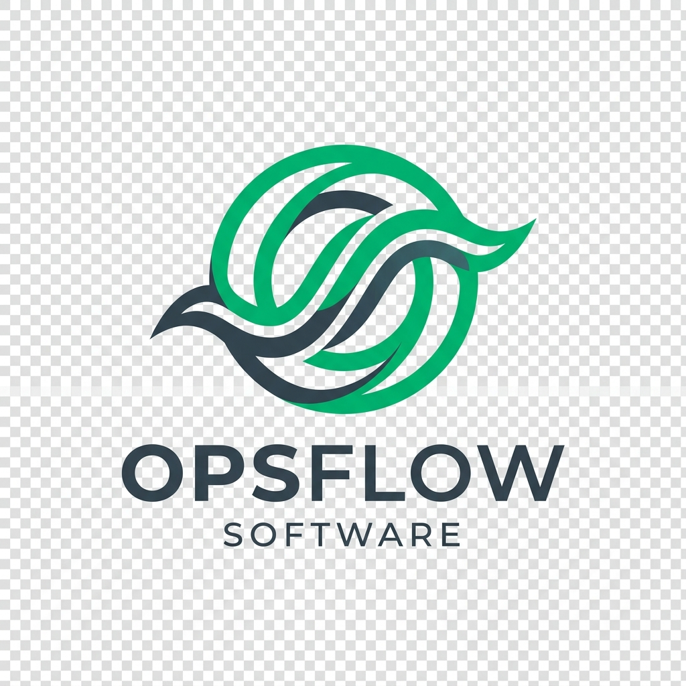

# Architecture Explanation



OpsFlow is designed as a decoupled, multi tier Full Stack Enterprise Operations Portal.

```
+-------------------------------------------------------+
|                    Client Layer                       |
|           React + TypeScript + Vite                   |
|     (Dark/Light Themes, PDF Invoice Generator)         |
+-------------------------------------------------------+
                           |
                     REST APIs (HTTP)
                           |
+-------------------------------------------------------+
|                    Server Layer                       |
|           Node.js + Express + TypeScript              |
|        (JWT Middleware & Role Based Access)           |
+-------------------------------------------------------+
                           |
                 Supabase JavaScript SDK
                           |
+-------------------------------------------------------+
|                   Database Layer                      |
|              Supabase Cloud PostgreSQL                |
|    (Users, Customers, Products, Stock, Challans)      |
+-------------------------------------------------------+
```

## System Components

### 1. Presentation Layer (Frontend)
- Built with React 18 and TypeScript.
- Styled using a bespoke CSS token system with Light Mode as default theme and Dark Mode toggle.
- PDF generation handled client side via jsPDF.

### 2. Application Layer (Backend API)
- Express.js application written in TypeScript.
- Middleware handles JWT verification and Role Based Access Control (RBAC).
- Atomic stock reduction logic handles sales challan confirmation.

### 3. Data Storage Layer (Database)
- Hosted Supabase Cloud PostgreSQL instance.
- Direct query execution via Supabase Client SDK using service role privileges.
